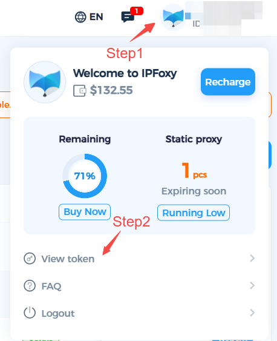

1. Example Explanation


The API request path for the **"[Region Query](https://www.ipfoxy.com/help/docs/Regional-query)"** function is: `https://apis.ipfoxy.com/ip/open-api/area-list`

The API request domain is `https://apis.ipfoxy.com`, the specific path is `/ip/open-api/area-list`, and the request method is **GET**. The request header must always include `api-token` (Proxy Key) and `api-id` (User ID). Please refer to the image below for instructions on how to obtain these credentials. The request frequency is limited to **60 requests per minute** per account.

 



2. Python Call Example


```python
import http.client

conn = http.client.HTTPSConnection("apis.ipfoxy.com")

headers = {
    'api-token': "Enter_your_secret_key",
    'api-id': "Enter_your_user_id"
}

conn.request("GET", "/ip/open-api/area-list", headers=headers)

res = conn.getresponse()
data = res.read()

print(data.decode("utf-8"))
```

3. Golang calling example


```python
package main

import (
	"fmt"
	"net/http"
	"io"
)

func main() {
	url := "https://apis.ipfoxy.com/ip/open-api/area-list"

	req, _ := http.NewRequest("GET", url, nil)

	req.Header.Add("api-token", "Enter_your_secret_key")
	req.Header.Add("api-id", "Enter_your_user_id")

	res, _ := http.DefaultClient.Do(req)

	defer res.Body.Close()
	body, _ := io.ReadAll(res.Body)

	fmt.Println(res)
	fmt.Println(string(body))
}
```

4. Node.js-Native Call Example


```javascript
const http = require('https');

const options = {
  method: 'GET',
  hostname: 'apis.ipfoxy.com',
  port: null,
  path: '/ip/open-api/area-list',
  headers: {
    'api-token': 'Enter_your_secret_key',
    'api-id': 'Enter_your_user_id'
  }
};

const req = http.request(options, function (res) {
  const chunks = [];

  res.on('data', function (chunk) {
    chunks.push(chunk);
  });

  res.on('end', function () {
    const body = Buffer.concat(chunks);
    console.log(body.toString());
  });
});

req.end();
```

5. PHP-HTTP call example


```php
<?php

$request = new HttpRequest();
$request->setUrl('https://apis.ipfoxy.com/ip/open-api/area-list');
$request->setMethod(HTTP_METH_GET);

$request->setHeaders([
  'api-token' => 'Enter_your_secret_key',
  'api-id' => 'Enter_your_user_id'
]);

try {
  $response = $request->send();
  echo $response->getBody();
} catch (HttpException $ex) {
  echo $ex;
}
```

6. C# Call Example


```csharp
using System.Net.Http.Headers;

var client = new HttpClient();
var request = new HttpRequestMessage
{
    Method = HttpMethod.Get,
    RequestUri = new Uri("https://apis.ipfoxy.com/ip/open-api/area-list"),
    Headers =
    {
        { "api-token", "Enter_your_secret_key" },
        { "api-id", "Enter_your_user_id" },
    },
};

using (var response = await client.SendAsync(request))
{
    response.EnsureSuccessStatusCode();
    var body = await response.Content.ReadAsStringAsync();
    Console.WriteLine(body);
}
```

7. C Language Call Example


```c
CURL *hnd = curl_easy_init();

curl_easy_setopt(hnd, CURLOPT_CUSTOMREQUEST, "GET");
curl_easy_setopt(hnd, CURLOPT_URL, "https://apis.ipfoxy.com/ip/open-api/area-list");

struct curl_slist *headers = NULL;
headers = curl_slist_append(headers, "api-token: Enter_your_secret_key");
headers = curl_slist_append(headers, "api-id: Enter_your_user_id");
curl_easy_setopt(hnd, CURLOPT_HTTPHEADER, headers);

CURLcode ret = curl_easy_perform(hnd);
```

8. Java call example


```markup
AsyncHttpClient client = new DefaultAsyncHttpClient();
client.prepare("GET", "https://apis.ipfoxy.com/ip/open-api/area-list")
  .setHeader("api-token", "Enter_your_secret_key")
  .setHeader("api-id", "Enter_your_user_id")
  .execute()
  .toCompletableFuture()
  .thenAccept(System.out::println)
  .join();

client.close();
```