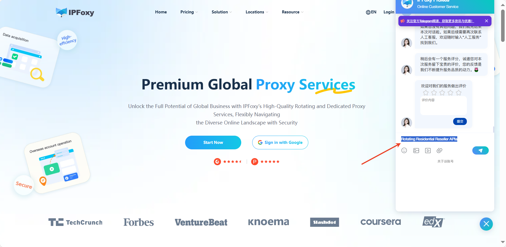

# Read Before Installation (Important)

**Important:** This API documentation applies **only** to officially certified rotating proxies. Please read the following instructions carefully before proceeding.

1. Rotating Proxy Resellers

If you are a partner with your own sales channels and wish to integrate our **Rotating Residential Proxy** products into your distribution system, this API document will serve as your core guide for technical integration.

The reseller API documents for dynamic residential proxies in this directory are not authorized by default, and API requests will not succeed.To obtain access, you must first apply to become an **officially certified rotating proxy reseller**.

**2. How to apply to become a rotating proxy reseller and obtain API access?**

(1) Please visit our official website: [www.ipfoxy.com](https://www.ipfoxy.com/)

(2) Find **the “Online Customer Service” consultation entrance** in **the lower right** corner of the official website.

(3) Leave the keyword **[Rotating Residential Reseller API ]** through this entrance and wait for manual customer service to receive you.

**Note:** You will be required to provide relevant company or business information for review. Our team will evaluate your application and, upon approval, create a reseller account for you to obtain the corresponding API access permissions.

**(4)** The API endpoints described in this document will become active **only after** you have successfully completed the application process **and** received official confirmation from us granting you API access.

**3. Get started**

After completing the application and registration process, you will be able to use the corresponding API integration features via the following API documentation:

- [Rotating Resellers Obtains Account Traffic Information](https://www.ipfoxy.com/help/docs/dong-tai-dai-li-shang-huo-qu-zhang-hao-liu-liang)
- [Rotating Resellers Obtains Account List](https://www.ipfoxy.com/help/docs/dong-tai-dai-li-shang-huo-qu-zhang-hao-lie-biao)
- [Rotating Resellers Changes Account Password](https://www.ipfoxy.com/help/docs/dong-tai-dai-li-shang-geng-gai-zhang-hao-mi-ma)
- [Rotating Resellers Changes Account Whitelist](https://www.ipfoxy.com/help/docs/dong-tai-dai-li-shang-geng-gai-zhang-hao-bai-ming-dan)
- [Rotating Resellers  Allocate Traffic to Accounts](https://www.ipfoxy.com/help/docs/dong-tai-dai-li-shang-gei-zhang-hao-fen-pei-liu-liang)
- [Rotating Resellers Account Creation](https://www.ipfoxy.com/help/docs/dong-tai-dai-li-shang-chuang-jian-zhang-hao)
- [Rotating Resellers Access to Rotating Proxy line Regions](https://www.ipfoxy.com/help/docs/dong-tai-dai-li-shang-huo-qu-zhi-chi-dong-tai-xian-lu-qu-yu)
- [Rotating Proxy Reseller Account Traffic Usage Details](https://www.ipfoxy.com/help/docs/dong-tai-dai-li-shang-zhang-hao-liu-liang-shi-yong-xiang-qing)

 

**4. Technical Support**

If authorized agents encounter technical problems during integration or use of the API, please seek help from your dedicated account manager or [the official technical support](https://www.ipfoxy.com/) channels.